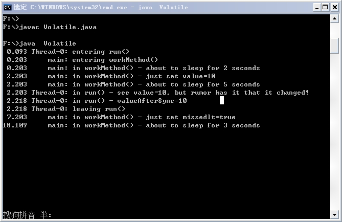

# Volatile 关键字（下）

在《Volatile 关键字（上）》一文中遗留了一个问题，就是 volatile 只修饰了 missedIt 变量，而没修饰value 变量，但是在线程读取 value 的值的时候，也读到的是最新的数据。

下面讲解问题出现的原因。

首先明确一点：假如有两个线程分别读写 volatile 变量时，线程 A 写入了某 volatile 变量，线程 B 在读取该 volatile 变量时，便能看到线程 A 对该 volatile 变量的写入操作，关键在这里，它不仅会看到对该 volatile 变量的写入操作，A 线程在写 volatile 变量之前所有可见的共享变量，在 B 线程读同一个 volatile 变量后，都将立即变得对 B 线程可见。

回过头来看文章中出现的问题，由于程序中 volatile 变量 missedIt 的写入操作在 value 变量写入操作之后，而且根据 volatile 规则，又不能重排序，因此，在线程 B 读取由线程 A 改变后的 missedIt 之后，它之前的 value 变量在线程 A 的改变也对线程 B 变得可见了。

我们颠倒一下 value=50 和 missedIt=true 这两行代码试下，即 missedIt=true 在前，value=50 在后，这样便会得到我们想要的结果：value 值的改变不会被看到。

这应该是 JDK1.2 之后对 volatile 规则做了一些修订的结果。

修改后的代码如下：

```
public class Volatile extends Object implements Runnable {  
    //value变量没有被标记为volatile  
    private int value;    
    //missedIt变量被标记为volatile  
    private volatile boolean missedIt;  
    //creationTime不需要声明为volatile，因为代码执行中它没有发生变化  
    private long creationTime;   
  
    public Volatile() {  
        value = 10;  
        missedIt = false;  
        //获取当前时间，亦即调用Volatile构造函数时的时间  
        creationTime = System.currentTimeMillis();  
    }  
  
    public void run() {  
        print("entering run()");  
  
        //循环检查value的值是否不同  
        while ( value < 20 ) {  
            //如果missedIt的值被修改为true，则通过break退出循环  
            if  ( missedIt ) {  
                //进入同步代码块前，将value的值赋给currValue  
                int currValue = value;  
                //在一个任意对象上执行同步语句，目的是为了让该线程在进入和离开同步代码块时，  
                //将该线程中的所有变量的私有拷贝与共享内存中的原始值进行比较，  
                //从而发现没有用volatile标记的变量所发生的变化  
                Object lock = new Object();  
                synchronized ( lock ) {  
                    //不做任何事  
                }  
                //离开同步代码块后，将此时value的值赋给valueAfterSync  
                int valueAfterSync = value;  
                print("in run() - see value=" + currValue +", but rumor has it that it changed!");  
                print("in run() - valueAfterSync=" + valueAfterSync);  
                break;   
            }  
        }  
        print("leaving run()");  
    }  
  
    public void workMethod() throws InterruptedException {  
        print("entering workMethod()");  
        print("in workMethod() - about to sleep for 2 seconds");  
        Thread.sleep(2000);  
        //仅在此改变value的值  
        missedIt = true;  
//      value = 50;  
        print("in workMethod() - just set value=" + value);  
        print("in workMethod() - about to sleep for 5 seconds");  
        Thread.sleep(5000);  
        //仅在此改变missedIt的值  
//      missedIt = true;  
        value = 50;  
        print("in workMethod() - just set missedIt=" + missedIt);  
        print("in workMethod() - about to sleep for 3 seconds");  
        Thread.sleep(3000);  
        print("leaving workMethod()");  
    }  
  
/* 
*该方法的功能是在要打印的msg信息前打印出程序执行到此所化去的时间，以及打印msg的代码所在的线程 
*/  
    private void print(String msg) {  
        //使用java.text包的功能，可以简化这个方法，但是这里没有利用这一点  
        long interval = System.currentTimeMillis() - creationTime;  
        String tmpStr = "    " + ( interval / 1000.0 ) + "000";       
        int pos = tmpStr.indexOf(".");  
        String secStr = tmpStr.substring(pos - 2, pos + 4);  
        String nameStr = "        " + Thread.currentThread().getName();  
        nameStr = nameStr.substring(nameStr.length() - 8, nameStr.length());      
        System.out.println(secStr + " " + nameStr + ": " + msg);  
    }  
  
    public static void main(String[] args) {  
        try {  
            //通过该构造函数可以获取实时时钟的当前时间  
            Volatile vol = new Volatile();  
  
            //稍停100ms，以让实时时钟稍稍超前获取时间，使print（）中创建的消息打印的时间值大于0  
            Thread.sleep(100);    
  
            Thread t = new Thread(vol);  
            t.start();  
  
            //休眠100ms，让刚刚启动的线程有时间运行  
            Thread.sleep(100);    
            //workMethod方法在main线程中运行  
            vol.workMethod();  
        } catch ( InterruptedException x ) {  
            System.err.println("one of the sleeps was interrupted");  
        }  
    }  
}  
```

运行结果如下：



很明显，这其实并不符合使用 volatile 的第二个条件：**该变量要没有包含在具有其他变量的不变式中**。因此，在这里使用 volatile 是不安全的。

附上一篇讲述 volatile 关键字正确使用的很好的文章：[http://www.ibm.com/developerworks/cn/java/j-jtp06197.html](http://www.ibm.com/developerworks/cn/java/j-jtp06197.html)