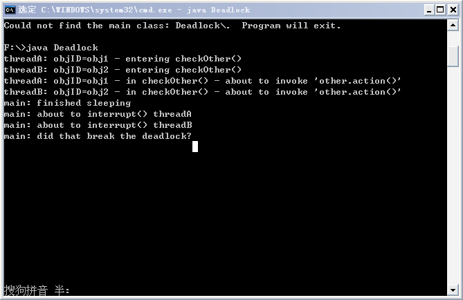

# 死锁

当线程需要同时持有多个锁时，有可能产生死锁。考虑如下情形：

线程 A 当前持有互斥所锁 lock1，线程 B 当前持有互斥锁 lock2。接下来，当线程 A 仍然持有 lock1 时，它试图获取 lock2，因为线程 B 正持有 lock2，因此线程 A 会阻塞等待线程 B 对 lock2 的释放。如果此时线程 B 在持有 lock2 的时候，也在试图获取 lock1，因为线程 A 正持有 lock1，因此线程 B 会阻塞等待 A 对 lock1 的释放。二者都在等待对方所持有锁的释放，而二者却又都没释放自己所持有的锁，这时二者便会一直阻塞下去。这种情形称为死锁。

下面给出一个两个线程间产生死锁的示例，如下：

```
public class Deadlock extends Object {  
    private String objID;  
  
    public Deadlock(String id) {  
        objID = id;  
    }  
  
    public synchronized void checkOther(Deadlock other) {  
        print("entering checkOther()");  
        try { Thread.sleep(2000); }   
        catch ( InterruptedException x ) { }  
        print("in checkOther() - about to " + "invoke 'other.action()'");  
  
        //调用other对象的action方法，由于该方法是同步方法，因此会试图获取other对象的对象锁  
        other.action();  
        print("leaving checkOther()");  
    }  
  
    public synchronized void action() {  
        print("entering action()");  
        try { Thread.sleep(500); }   
        catch ( InterruptedException x ) { }  
        print("leaving action()");  
    }  
  
    public void print(String msg) {  
        threadPrint("objID=" + objID + " - " + msg);  
    }  
  
    public static void threadPrint(String msg) {  
        String threadName = Thread.currentThread().getName();  
        System.out.println(threadName + ": " + msg);  
    }  
  
    public static void main(String[] args) {  
        final Deadlock obj1 = new Deadlock("obj1");  
        final Deadlock obj2 = new Deadlock("obj2");  
  
        Runnable runA = new Runnable() {  
                public void run() {  
                    obj1.checkOther(obj2);  
                }  
            };  
  
        Thread threadA = new Thread(runA, "threadA");  
        threadA.start();  
  
        try { Thread.sleep(200); }   
        catch ( InterruptedException x ) { }  
  
        Runnable runB = new Runnable() {  
                public void run() {  
                    obj2.checkOther(obj1);  
                }  
            };  
  
        Thread threadB = new Thread(runB, "threadB");  
        threadB.start();  
  
        try { Thread.sleep(5000); }   
        catch ( InterruptedException x ) { }  
  
        threadPrint("finished sleeping");  
  
        threadPrint("about to interrupt() threadA");  
        threadA.interrupt();  
  
        try { Thread.sleep(1000); }   
        catch ( InterruptedException x ) { }  
  
        threadPrint("about to interrupt() threadB");  
        threadB.interrupt();  
  
        try { Thread.sleep(1000); }   
        catch ( InterruptedException x ) { }  
  
        threadPrint("did that break the deadlock?");  
    }  
} 
```

运行结果如下：

 

从结果中可以看出，在执行到 other.action() 时，由于两个线程都在试图获取对方的锁，但对方都没有释放自己的锁，因而便产生了死锁，在主线程中试图中断两个线程，但都无果。

大部分代码并不容易产生死锁，死锁可能在代码中隐藏相当长的时间，等待不常见的条件地发生，但即使是很小的概率，一旦发生，便可能造成毁灭性的破坏。避免死锁是一件困难的事，遵循以下原则有助于规避死锁： 

- 只在必要的最短时间内持有锁，考虑使用同步语句块代替整个同步方法；
- 尽量编写不在同一时刻需要持有多个锁的代码，如果不可避免，则确保线程持有第二个锁的时间尽量短暂；
- 创建和使用一个大锁来代替若干小锁，并把这个锁用于互斥，而不是用作单个对象的对象级别锁。
