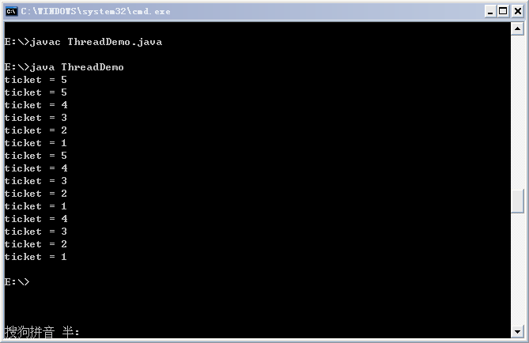

Java 中实现多线程有两种方法：继承 Thread 类、实现 Runnable 接口，在程序开发中只要是多线程，肯定永远以实现 Runnable 接口为主，因为实现 Runnable 接口相比继承 Thread 类有如下优势：

- 可以避免由于 Java 的单继承特性而带来的局限；
- 增强程序的健壮性，代码能够被多个线程共享，代码与数据是独立的；
- 适合多个相同程序代码的线程区处理同一资源的情况。

下面以典型的买票程序（基本都是以这个为例子）为例，来说明二者的区别。

首先通过继承 Thread 类实现，代码如下：

```
class MyThread extends Thread{  
    private int ticket = 5;  
    public void run(){  
        for (int i=0;i<10;i++)  
        {  
            if(ticket > 0){  
                System.out.println("ticket = " + ticket--);  
            }  
        }  
    }  
}  
  
public class ThreadDemo{  
    public static void main(String[] args){  
        new MyThread().start();  
        new MyThread().start();  
        new MyThread().start();  
    }  
} 
```

执行结果如下：



从结果中可以看出，每个线程单独卖了 5 张票，即独立地完成了买票的任务，但实际应用中，比如火车站售票，需要多个线程去共同完成任务，在本例中，即多个线程共同买 5 张票。

下面是通过实现 Runnable 接口实现的多线程程序，代码如下：

```
class MyThread implements Runnable{  
    private int ticket = 5;  
    public void run(){  
        for (int i=0;i<10;i++)  
        {  
            if(ticket > 0){  
                System.out.println("ticket = " + ticket--);  
            }  
        }  
    }  
}  
  
public class RunnableDemo{  
    public static void main(String[] args){  
        MyThread my = new MyThread();  
        new Thread(my).start();  
        new Thread(my).start();  
        new Thread(my).start();  
    }  
}
```

执行结果如下：


从结果中可以看出，三个线程一共卖了 5 张票，即它们共同完成了买票的任务，实现了资源的共享。

针对以上代码补充三点：

- 在第二种方法（Runnable）中，ticket 输出的顺序并不是 54321，这是因为线程执行的时机难以预测，ticket--并不是原子操作。
- 在第一种方法中，我们 new 了 3 个 Thread 对象，即三个线程分别执行三个对象中的代码，因此便是三个线程去独立地完成卖票的任务；而在第二种方法中，我们同样也 new 了 3 个 Thread 对象，但只有一个 Runnable 对象，3 个 Thread 对象共享这个 Runnable 对象中的代码，因此，便会出现 3 个线程共同完成卖票任务的结果。如果我们 new 出 3 个 Runnable 对象，作为参数分别传入 3 个 Thread 对象中，那么 3 个线程便会独立执行各自 Runnable 对象中的代码，即 3 个线程各自卖 5 张票。
- 在第二种方法中，由于 3 个 Thread 对象共同执行一个 Runnable 对象中的代码，因此可能会造成线程的不安全，比如可能 ticket 会输出 -1（如果我们 System.out....语句前加上线程休眠操作，该情况将很有可能出现），这种情况的出现是由于，一个线程在判断 ticket 为 1>0 后，还没有来得及减 1，另一个线程已经将 ticket 减 1，变为了 0，那么接下来之前的线程再将 ticket 减 1，便得到了 -1。这就需要加入同步操作（即互斥锁），确保同一时刻只有一个线程在执行每次 for 循环中的操作。而在第一种方法中，并不需要加入同步操作，因为每个线程执行自己 Thread 对象中的代码，不存在多个线程共同执行同一个方法的情况。