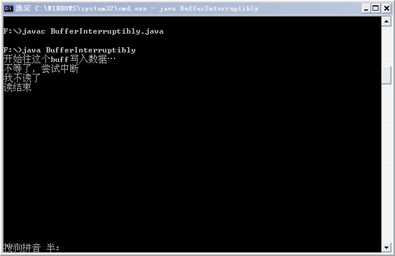

# 并发新特性—Lock 锁与条件变量

## 简单使用 Lock 锁

Java 5 中引入了新的锁机制——java.util.concurrent.locks 中的显式的互斥锁：Lock 接口，它提供了比synchronized 更加广泛的锁定操作。Lock 接口有 3 个实现它的类：ReentrantLock、ReetrantReadWriteLock.ReadLock 和 ReetrantReadWriteLock.WriteLock，即重入锁、读锁和写锁。lock 必须被显式地创建、锁定和释放，为了可以使用更多的功能，一般用 ReentrantLock 为其实例化。为了保证锁最终一定会被释放（可能会有异常发生），要把互斥区放在 try 语句块内，并在 finally 语句块中释放锁，尤其当有 return 语句时，return 语句必须放在 try 字句中，以确保 unlock（）不会过早发生，从而将数据暴露给第二个任务。因此，采用 lock 加锁和释放锁的一般形式如下：

```
Lock lock = new ReentrantLock();//默认使用非公平锁，如果要使用公平锁，需要传入参数true  
........  
lock.lock();  
try {  
     //更新对象的状态  
    //捕获异常，必要时恢复到原来的不变约束  
   //如果有return语句，放在这里  
 finally {  
       lock.unlock();        //锁必须在finally块中释放  
```

## ReetrankLock 与 synchronized 比较

### 性能比较

在 JDK1.5 中，synchronized 是性能低效的。因为这是一个重量级操作，它对性能最大的影响是阻塞的是实现，挂起线程和恢复线程的操作都需要转入内核态中完成，这些操作给系统的并发性带来了很大的压力。相比之下使用Java 提供的 Lock 对象，性能更高一些。Brian Goetz 对这两种锁在 JDK1.5、单核处理器及双 Xeon 处理器环境下做了一组吞吐量对比的实验，发现多线程环境下，synchronized的吞吐量下降的非常严重，而ReentrankLock 则能基本保持在同一个比较稳定的水平上。但与其说 ReetrantLock 性能好，倒不如说 synchronized 还有非常大的优化余地，于是到了 JDK1.6，发生了变化，对 synchronize 加入了很多优化措施，有自适应自旋，锁消除，锁粗化，轻量级锁，偏向锁等等。导致在 JDK1.6 上 synchronize 的性能并不比 Lock 差。官方也表示，他们也更支持 synchronize，在未来的版本中还有优化余地，所以还是提倡在 synchronized 能实现需求的情况下，优先考虑使用 synchronized 来进行同步。

**下面浅析以下两种锁机制的底层的实现策略。**

互斥同步最主要的问题就是进行线程阻塞和唤醒所带来的性能问题，因而这种同步又称为阻塞同步，它属于一种悲观的并发策略，即线程获得的是独占锁。独占锁意味着其他线程只能依靠阻塞来等待线程释放锁。而在 CPU 转换线程阻塞时会引起线程上下文切换，当有很多线程竞争锁的时候，会引起 CPU 频繁的上下文切换导致效率很低。synchronized 采用的便是这种并发策略。

随着指令集的发展，我们有了另一种选择：基于冲突检测的乐观并发策略，通俗地讲就是先进性操作，如果没有其他线程争用共享数据，那操作就成功了，如果共享数据被争用，产生了冲突，那就再进行其他的补偿措施（最常见的补偿措施就是不断地重拾，直到试成功为止），这种乐观的并发策略的许多实现都不需要把线程挂起，因此这种同步被称为非阻塞同步。ReetrantLock 采用的便是这种并发策略。

在乐观的并发策略中，需要操作和冲突检测这两个步骤具备原子性，它靠硬件指令来保证，这里用的是 CAS 操作（Compare and Swap）。JDK1.5 之后，Java 程序才可以使用CAS操作。我们可以进一步研究 ReentrantLock 的源代码，会发现其中比较重要的获得锁的一个方法是 compareAndSetState，这里其实就是调用的 CPU 提供的特殊指令。现代的 CPU 提供了指令，可以自动更新共享数据，而且能够检测到其他线程的干扰，而 compareAndSet() 就用这些代替了锁定。这个算法称作非阻塞算法，意思是一个线程的失败或者挂起不应该影响其他线程的失败或挂起。

Java 5 中引入了注入 AutomicInteger、AutomicLong、AutomicReference 等特殊的原子性变量类，它们提供的如：compareAndSet（）、incrementAndSet（）和getAndIncrement（）等方法都使用了 CAS 操作。因此，它们都是由硬件指令来保证的原子方法。

### 用途比较

基本语法上，ReentrantLock 与 synchronized 很相似，它们都具备一样的线程重入特性，只是代码写法上有点区别而已，一个表现为 API 层面的互斥锁（Lock），一个表现为原生语法层面的互斥锁（synchronized）。ReentrantLock 相对 synchronized 而言还是增加了一些高级功能，主要有以下三项：

- 等待可中断：当持有锁的线程长期不释放锁时，正在等待的线程可以选择放弃等待，改为处理其他事情，它对处理执行时间非常上的同步块很有帮助。而在等待由 synchronized 产生的互斥锁时，会一直阻塞，是不能被中断的。
- 可实现公平锁：多个线程在等待同一个锁时，必须按照申请锁的时间顺序排队等待，而非公平锁则不保证这点，在锁释放时，任何一个等待锁的线程都有机会获得锁。synchronized 中的锁时非公平锁，ReentrantLock 默认情况下也是非公平锁，但可以通过构造方法 ReentrantLock（ture）来要求使用公平锁。
- 锁可以绑定多个条件：ReentrantLock 对象可以同时绑定多个 Condition 对象（名曰：条件变量或条件队列），而在 synchronized 中，锁对象的 wait（）和 notify（）或 notifyAll（）方法可以实现一个隐含条件，但如果要和多于一个的条件关联的时候，就不得不额外地添加一个锁，而 ReentrantLock 则无需这么做，只需要多次调用 newCondition（）方法即可。而且我们还可以通过绑定 Condition 对象来判断当前线程通知的是哪些线程（即与 Condition 对象绑定在一起的其他线程）。

## 可中断锁

ReetrantLock 有两种锁：忽略中断锁和响应中断锁。忽略中断锁与 synchronized 实现的互斥锁一样，不能响应中断，而响应中断锁可以响应中断。

如果某一线程 A 正在执行锁中的代码，另一线程B正在等待获取该锁，可能由于等待时间过长，线程 B 不想等待了，想先处理其他事情，我们可以让它中断自己或者在别的线程中中断它，如果此时 ReetrantLock 提供的是忽略中断锁，则它不会去理会该中断，而是让线程B继续等待，而如果此时 ReetrantLock 提供的是响应中断锁，那么它便会处理中断，让线程 B 放弃等待，转而去处理其他事情。

获得响应中断锁的一般形式如下：

```
ReentrantLock lock = new ReentrantLock();  
...........  
lock.lockInterruptibly();//获取响应中断锁  
try {  
      //更新对象的状态  
      //捕获异常，必要时恢复到原来的不变约束  
      //如果有return语句，放在这里  
}finally{  
    lock.unlock();        //锁必须在finally块中释放  
} 
```

这里有一个不错的分析中断的示例代码（摘自网上）。

当用 synchronized 中断对互斥锁的等待时，并不起作用，该线程依然会一直等待，如下面的实例：

```
public class Buffer {  
  
    private Object lock;  
  
    public Buffer() {  
        lock = this;  
    }  
  
    public void write() {  
        synchronized (lock) {  
            long startTime = System.currentTimeMillis();  
            System.out.println("开始往这个buff写入数据…");  
            for (;;)// 模拟要处理很长时间      
            {  
                if (System.currentTimeMillis()  
                        - startTime > Integer.MAX_VALUE) {  
                    break;  
                }  
            }  
            System.out.println("终于写完了");  
        }  
    }  
  
    public void read() {  
        synchronized (lock) {  
            System.out.println("从这个buff读数据");  
        }  
    }  
  
    public static void main(String[] args) {  
        Buffer buff = new Buffer();  
  
        final Writer writer = new Writer(buff);  
        final Reader reader = new Reader(buff);  
  
        writer.start();  
        reader.start();  
  
        new Thread(new Runnable() {  
  
            @Override  
            public void run() {  
                long start = System.currentTimeMillis();  
                for (;;) {  
                    //等5秒钟去中断读      
                    if (System.currentTimeMillis()  
                            - start > 5000) {  
                        System.out.println("不等了，尝试中断");  
                        reader.interrupt();  //尝试中断读线程  
                        break;  
                    }  
  
                }  
  
            }  
        }).start();  
        // 我们期待“读”这个线程能退出等待锁，可是事与愿违，一旦读这个线程发现自己得不到锁，  
        // 就一直开始等待了，就算它等死，也得不到锁，因为写线程要21亿秒才能完成 T_T ，即使我们中断它，  
        // 它都不来响应下，看来真的要等死了。这个时候，ReentrantLock给了一种机制让我们来响应中断，  
        // 让“读”能伸能屈，勇敢放弃对这个锁的等待。我们来改写Buffer这个类，就叫BufferInterruptibly吧，可中断缓存。  
    }  
}  
  
class Writer extends Thread {  
  
    private Buffer buff;  
  
    public Writer(Buffer buff) {  
        this.buff = buff;  
    }  
  
    @Override  
    public void run() {  
        buff.write();  
    }  
}  
  
class Reader extends Thread {  
  
    private Buffer buff;  
  
    public Reader(Buffer buff) {  
        this.buff = buff;  
    }  
  
    @Override  
    public void run() {  
  
        buff.read();//这里估计会一直阻塞      
  
        System.out.println("读结束");  
  
    }  
}  
```

执行结果如下：


我们等待了很久，后面依然没有输出，说明读线程对互斥锁的等待并没有被中断，也就是该户吃锁没有响应对读线程的中断。

我们再将上面代码中 synchronized 的互斥锁改为 ReentrantLock 的响应中断锁，即改为如下代码：

```
import java.util.concurrent.locks.ReentrantLock;  
  
public class BufferInterruptibly {  
  
    private ReentrantLock lock = new ReentrantLock();  
  
    public void write() {  
        lock.lock();  
        try {  
            long startTime = System.currentTimeMillis();  
            System.out.println("开始往这个buff写入数据…");  
            for (;;)// 模拟要处理很长时间      
            {  
                if (System.currentTimeMillis()  
                        - startTime > Integer.MAX_VALUE) {  
                    break;  
                }  
            }  
            System.out.println("终于写完了");  
        } finally {  
            lock.unlock();  
        }  
    }  
  
    public void read() throws InterruptedException {  
        lock.lockInterruptibly();// 注意这里，可以响应中断      
        try {  
            System.out.println("从这个buff读数据");  
        } finally {  
            lock.unlock();  
        }  
    }  
  
    public static void main(String args[]) {  
        BufferInterruptibly buff = new BufferInterruptibly();  
  
        final Writer2 writer = new Writer2(buff);  
        final Reader2 reader = new Reader2(buff);  
  
        writer.start();  
        reader.start();  
  
        new Thread(new Runnable() {  
  
            @Override  
            public void run() {  
                long start = System.currentTimeMillis();  
                for (;;) {  
                    if (System.currentTimeMillis()  
                            - start > 5000) {  
                        System.out.println("不等了，尝试中断");  
                        reader.interrupt();  //此处中断读操作  
                        break;  
                    }  
                }  
            }  
        }).start();  
  
    }  
}  
  
class Reader2 extends Thread {  
  
    private BufferInterruptibly buff;  
  
    public Reader2(BufferInterruptibly buff) {  
        this.buff = buff;  
    }  
  
    @Override  
    public void run() {  
  
        try {  
            buff.read();//可以收到中断的异常，从而有效退出      
        } catch (InterruptedException e) {  
            System.out.println("我不读了");  
        }  
  
        System.out.println("读结束");  
  
    }  
}  
  
class Writer2 extends Thread {  
  
    private BufferInterruptibly buff;  
  
    public Writer2(BufferInterruptibly buff) {  
        this.buff = buff;  
    }  
  
    @Override  
    public void run() {  
        buff.write();  
    }  
      
}  
```

执行结果如下：

 

从结果中可以看出，尝试中断后输出了 catch 语句块中的内容，也输出了后面的“读结束”，说明线程对互斥锁的等待被中断了，也就是该互斥锁响应了对读线程的中断。

## 条件变量实现线程间协作

在**生产者——消费者模型**一文中，我们用 synchronized 实现互斥，并配合使用 Object 对象的 wait（）和 notify（）或 notifyAll（）方法来实现线程间协作。Java 5 之后，我们可以用 Reentrantlock 锁配合 Condition 对象上的 await（）和 signal（）或 signalAll（）方法来实现线程间协作。在 ReentrantLock 对象上 newCondition（）可以得到一个 Condition 对象，可以通过在 Condition 上调用 await（）方法来挂起一个任务（线程），通过在 Condition 上调用 signal（）来通知任务，从而唤醒一个任务，或者调用 signalAll（）来唤醒所有在这个 Condition 上被其自身挂起的任务。另外，如果使用了公平锁，signalAll（）的与 Condition 关联的所有任务将以 FIFO 队列的形式获取锁，如果没有使用公平锁，则获取锁的任务是随机的，这样我们便可以更好地控制处在 await 状态的任务获取锁的顺序。与 notifyAll（）相比，signalAll（）是更安全的方式。另外，它可以指定唤醒与自身 Condition 对象绑定在一起的任务。

下面将生产者——消费者模型一文中的代码改为用条件变量实现，如下：

```
import java.util.concurrent.*;  
import java.util.concurrent.locks.*;  
  
class Info{ // 定义信息类  
    private String name = "name";//定义name属性，为了与下面set的name属性区别开  
    private String content = "content" ;// 定义content属性，为了与下面set的content属性区别开  
    private boolean flag = true ;   // 设置标志位,初始时先生产  
    private Lock lock = new ReentrantLock();    
    private Condition condition = lock.newCondition(); //产生一个Condition对象  
    public  void set(String name,String content){  
        lock.lock();  
        try{  
            while(!flag){  
                condition.await() ;  
            }  
            this.setName(name) ;    // 设置名称  
            Thread.sleep(300) ;  
            this.setContent(content) ;  // 设置内容  
            flag  = false ; // 改变标志位，表示可以取走  
            condition.signal();  
        }catch(InterruptedException e){  
            e.printStackTrace() ;  
        }finally{  
            lock.unlock();  
        }  
    }  
  
    public void get(){  
        lock.lock();  
        try{  
            while(flag){  
                condition.await() ;  
            }     
            Thread.sleep(300) ;  
            System.out.println(this.getName() +   
                " --> " + this.getContent()) ;  
            flag  = true ;  // 改变标志位，表示可以生产  
            condition.signal();  
        }catch(InterruptedException e){  
            e.printStackTrace() ;  
        }finally{  
            lock.unlock();  
        }  
    }  
  
    public void setName(String name){  
        this.name = name ;  
    }  
    public void setContent(String content){  
        this.content = content ;  
    }  
    public String getName(){  
        return this.name ;  
    }  
    public String getContent(){  
        return this.content ;  
    }  
}  
class Producer implements Runnable{ // 通过Runnable实现多线程  
    private Info info = null ;      // 保存Info引用  
    public Producer(Info info){  
        this.info = info ;  
    }  
    public void run(){  
        boolean flag = true ;   // 定义标记位  
        for(int i=0;i<10;i++){  
            if(flag){  
                this.info.set("姓名--1","内容--1") ;    // 设置名称  
                flag = false ;  
            }else{  
                this.info.set("姓名--2","内容--2") ;    // 设置名称  
                flag = true ;  
            }  
        }  
    }  
}  
class Consumer implements Runnable{  
    private Info info = null ;  
    public Consumer(Info info){  
        this.info = info ;  
    }  
    public void run(){  
        for(int i=0;i<10;i++){  
            this.info.get() ;  
        }  
    }  
}  
public class ThreadCaseDemo{  
    public static void main(String args[]){  
        Info info = new Info(); // 实例化Info对象  
        Producer pro = new Producer(info) ; // 生产者  
        Consumer con = new Consumer(info) ; // 消费者  
        new Thread(pro).start() ;  
        //启动了生产者线程后，再启动消费者线程  
        try{  
            Thread.sleep(500) ;  
        }catch(InterruptedException e){  
            e.printStackTrace() ;  
        }  
  
        new Thread(con).start() ;  
    }  
}  
```

执行后，同样可以得到如下的结果：

```
姓名--1 --> 内容--1
姓名--2 --> 内容--2
姓名--1 --> 内容--1
姓名--2 --> 内容--2
姓名--1 --> 内容--1
姓名--2 --> 内容--2
姓名--1 --> 内容--1
姓名--2 --> 内容--2
姓名--1 --> 内容--1
姓名--2 --> 内容--2
```

从以上并不能看出用条件变量的 await（）、signal（）、signalAll（）方法比用 Object 对象的 wait（）、notify（）、notifyAll（）方法实现线程间协作有多少优点，但它在处理更复杂的多线程问题时，会有明显的优势。所以，Lock 和 Condition 对象只有在更加困难的多线程问题中才是必须的。

## 读写锁

另外，synchronized 获取的互斥锁不仅互斥读写操作、写写操作，还互斥读读操作，而读读操作时不会带来数据竞争的，因此对对读读操作也互斥的话，会降低性能。Java 5 中提供了读写锁，它将读锁和写锁分离，使得读读操作不互斥，获取读锁和写锁的一般形式如下：

```
ReadWriteLock rwl = new ReentrantReadWriteLock();      
rwl.writeLock().lock()  //获取写锁  
rwl.readLock().lock()  //获取读锁  
```

用读锁来锁定读操作，用写锁来锁定写操作，这样写操作和写操作之间会互斥，读操作和写操作之间会互斥，但读操作和读操作就不会互斥。

《Java 并发编程实践》一书给出了使用 ReentrantLock 的最佳时机：

当你需要以下高级特性时，才应该使用：可定时的、可轮询的与可中断的锁获取操作，公平队列，或者非块结构的锁。否则，请使用 synchronized。 
