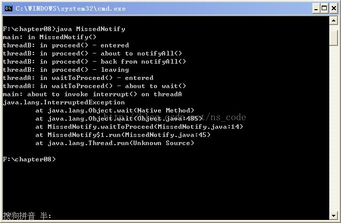
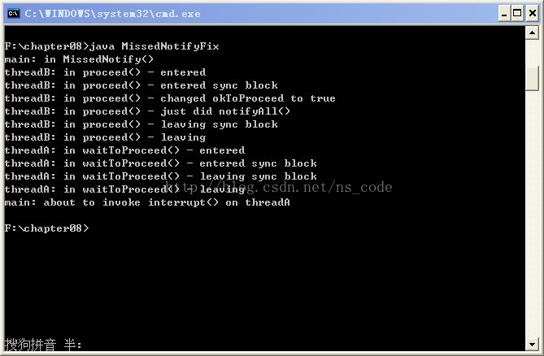

# notify 通知的遗漏

notify 通知的遗漏很容易理解，即 threadA 还没开始 wait 的时候，threadB 已经 notify 了，这样，threadB 通知是没有任何响应的，当 threadB 退出 synchronized 代码块后，threadA 再开始 wait，便会一直阻塞等待，直到被别的线程打断。

## 遗漏通知的代码

下面给出一段代码演示通知是如何遗漏的，如下：

```
public class MissedNotify extends Object {  
    private Object proceedLock;  
  
    public MissedNotify() {  
        print("in MissedNotify()");  
        proceedLock = new Object();  
    }  
  
    public void waitToProceed() throws InterruptedException {  
        print("in waitToProceed() - entered");  
  
        synchronized ( proceedLock ) {  
            print("in waitToProceed() - about to wait()");  
            proceedLock.wait();  
            print("in waitToProceed() - back from wait()");  
        }  
  
        print("in waitToProceed() - leaving");  
    }  
  
    public void proceed() {  
        print("in proceed() - entered");  
  
        synchronized ( proceedLock ) {  
            print("in proceed() - about to notifyAll()");  
            proceedLock.notifyAll();  
            print("in proceed() - back from notifyAll()");  
        }  
  
        print("in proceed() - leaving");  
    }  
  
    private static void print(String msg) {  
        String name = Thread.currentThread().getName();  
        System.out.println(name + ": " + msg);  
    }  
  
    public static void main(String[] args) {  
        final MissedNotify mn = new MissedNotify();  
  
        Runnable runA = new Runnable() {  
                public void run() {  
                    try {  
                        //休眠1000ms，大于runB中的500ms，  
                        //是为了后调用waitToProceed，从而先notifyAll，后wait，  
                        //从而造成通知的遗漏  
                        Thread.sleep(1000);  
                        mn.waitToProceed();  
                    } catch ( InterruptedException x ) {  
                        x.printStackTrace();  
                    }  
                }  
            };  
  
        Thread threadA = new Thread(runA, "threadA");  
        threadA.start();  
  
        Runnable runB = new Runnable() {  
                public void run() {  
                    try {  
                        //休眠500ms，小于runA中的1000ms，  
                        //是为了先调用proceed，从而先notifyAll，后wait，  
                        //从而造成通知的遗漏  
                        Thread.sleep(500);  
                        mn.proceed();  
                    } catch ( InterruptedException x ) {  
                        x.printStackTrace();  
                    }  
                }  
            };  
  
        Thread threadB = new Thread(runB, "threadB");  
        threadB.start();  
  
        try {   
            Thread.sleep(10000);  
        } catch ( InterruptedException x ) {}  
  
        //试图打断wait阻塞  
        print("about to invoke interrupt() on threadA");  
        threadA.interrupt();  
    }  
}  
```

执行结果如下：



分析：由于 threadB 在执行 mn.proceed()之前只休眠了 500ms，而 threadA 在执行 mn.waitToProceed()之前休眠了 1000ms，因此，threadB 会先苏醒，继而执行 mn.proceed()，获取到 proceedLock 的对象锁，继而执行其中的 notifyAll()，当退出 proceed()方法中的 synchronized 代码块时，threadA 才有机会获取 proceedLock 的对象锁，继而执行其中的 wait()方法，但此时 notifyAll()方法已经执行完毕，threadA 便漏掉了 threadB 的通知，便会阻塞下去。后面主线程休眠 10 秒后，尝试中断 threadA 线程，使其抛出 InterruptedException。

## 修正后的代码

为了修正 MissedNotify，需要添加一个 boolean 指示变量，该变量只能在同步代码块内部访问和修改。修改后的代码如下：

```
public class MissedNotifyFix extends Object {  
    private Object proceedLock;  
    //该标志位用来指示线程是否需要等待  
    private boolean okToProceed;  
  
    public MissedNotifyFix() {  
        print("in MissedNotify()");  
        proceedLock = new Object();  
        //先设置为false  
        okToProceed = false;  
    }  
  
    public void waitToProceed() throws InterruptedException {  
        print("in waitToProceed() - entered");  
  
        synchronized ( proceedLock ) {  
            print("in waitToProceed() - entered sync block");  
            //while循环判断，这里不用if的原因是为了防止早期通知  
            while ( okToProceed == false ) {  
                print("in waitToProceed() - about to wait()");  
                proceedLock.wait();  
                print("in waitToProceed() - back from wait()");  
            }  
  
            print("in waitToProceed() - leaving sync block");  
        }  
  
        print("in waitToProceed() - leaving");  
    }  
  
    public void proceed() {  
        print("in proceed() - entered");  
  
        synchronized ( proceedLock ) {  
            print("in proceed() - entered sync block");  
            //通知之前，将其设置为true，这样即使出现通知遗漏的情况，也不会使线程在wait出阻塞  
            okToProceed = true;  
            print("in proceed() - changed okToProceed to true");  
            proceedLock.notifyAll();  
            print("in proceed() - just did notifyAll()");  
  
            print("in proceed() - leaving sync block");  
        }  
  
        print("in proceed() - leaving");  
    }  
  
    private static void print(String msg) {  
        String name = Thread.currentThread().getName();  
        System.out.println(name + ": " + msg);  
    }  
  
    public static void main(String[] args) {  
        final MissedNotifyFix mnf = new MissedNotifyFix();  
  
        Runnable runA = new Runnable() {  
                public void run() {  
                    try {  
                        //休眠1000ms，大于runB中的500ms，  
                        //是为了后调用waitToProceed，从而先notifyAll，后wait，  
                        Thread.sleep(1000);  
                        mnf.waitToProceed();  
                    } catch ( InterruptedException x ) {  
                        x.printStackTrace();  
                    }  
                }  
            };  
  
        Thread threadA = new Thread(runA, "threadA");  
        threadA.start();  
  
        Runnable runB = new Runnable() {  
                public void run() {  
                    try {  
                        //休眠500ms，小于runA中的1000ms，  
                        //是为了先调用proceed，从而先notifyAll，后wait，  
                        Thread.sleep(500);  
                        mnf.proceed();  
                    } catch ( InterruptedException x ) {  
                        x.printStackTrace();  
                    }  
                }  
            };  
  
        Thread threadB = new Thread(runB, "threadB");  
        threadB.start();  
  
        try {   
            Thread.sleep(10000);  
        } catch ( InterruptedException x ) {}  
  
        print("about to invoke interrupt() on threadA");  
        threadA.interrupt();  
    }  
}  
```

执行结果如下：



注意代码中加了注释的部分，在 threadB 进行通知之前，先将 okToProceed 置为 true，这样如果 threadA 将通知遗漏，那么就不会进入 while 循环，也便不会执行 wait 方法，线程也就不会阻塞。如果通知没有被遗漏，wait 方法返回后，okToProceed 已经被置为 true，下次 while 循环判断条件不成立，便会退出循环。

这样，通过标志位和 wait、notifyAll 的配合使用，便避免了通知遗漏而造成的阻塞问题。

总结：在使用线程的等待/通知机制时，一般都要配合一个 boolean 变量值（或者其他能够判断真假的条件），在 notify 之前改变该 boolean 变量的值，让 wait 返回后能够退出 while 循环（一般都要在 wait 方法外围加一层 while 循环，以防止早期通知），或在通知被遗漏后，不会被阻塞在 wait 方法处。这样便保证了程序的正确性。
