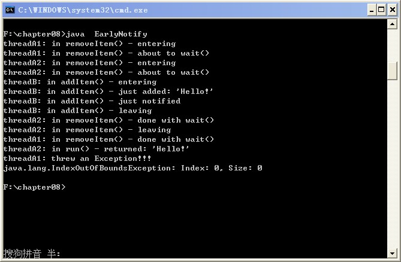

# notifyAll 造成的早期通知问题

如果线程在等待时接到通知，但线程等待的条件还不满足，此时，线程接到的就是早期通知，如果条件满足的时间很短，但很快又改变了，而变得不再满足，这时也将发生早期通知。这种现象听起来很奇怪，下面通过一个示例程序来说明问题。

很简单，两个线程等待删除 List 中的元素，同时另外一个线程正要向其中添加项目。代码如下：

```
import java.util.*;  
  
public class EarlyNotify extends Object {  
    private List list;  
  
    public EarlyNotify() {  
        list = Collections.synchronizedList(new LinkedList());  
    }  
  
    public String removeItem() throws InterruptedException {  
        print("in removeItem() - entering");  
  
        synchronized ( list ) {  
            if ( list.isEmpty() ) {  //这里用if语句会发生危险  
                print("in removeItem() - about to wait()");  
                list.wait();  
                print("in removeItem() - done with wait()");  
            }  
  
            //删除元素  
            String item = (String) list.remove(0);  
  
            print("in removeItem() - leaving");  
            return item;  
        }  
    }  
  
    public void addItem(String item) {  
        print("in addItem() - entering");  
        synchronized ( list ) {  
            //添加元素  
            list.add(item);  
            print("in addItem() - just added: '" + item + "'");  
  
            //添加后，通知所有线程  
            list.notifyAll();  
            print("in addItem() - just notified");  
        }  
        print("in addItem() - leaving");  
    }  
  
    private static void print(String msg) {  
        String name = Thread.currentThread().getName();  
        System.out.println(name + ": " + msg);  
    }  
  
    public static void main(String[] args) {  
        final EarlyNotify en = new EarlyNotify();  
  
        Runnable runA = new Runnable() {  
                public void run() {  
                    try {  
                        String item = en.removeItem();  
                        print("in run() - returned: '" +   
                                item + "'");  
                    } catch ( InterruptedException ix ) {  
                        print("interrupted!");  
                    } catch ( Exception x ) {  
                        print("threw an Exception!!!\n" + x);  
                    }  
                }  
            };  
  
        Runnable runB = new Runnable() {  
                public void run() {  
                    en.addItem("Hello!");  
                }  
            };  
  
        try {  
            //启动第一个删除元素的线程  
            Thread threadA1 = new Thread(runA, "threadA1");  
            threadA1.start();  
  
            Thread.sleep(500);  
      
            //启动第二个删除元素的线程  
            Thread threadA2 = new Thread(runA, "threadA2");  
            threadA2.start();  
  
            Thread.sleep(500);  
            //启动增加元素的线程  
            Thread threadB = new Thread(runB, "threadB");  
            threadB.start();  
  
            Thread.sleep(10000); // wait 10 seconds  
  
            threadA1.interrupt();  
            threadA2.interrupt();  
        } catch ( InterruptedException x ) {}  
    }  
}  
```

执行结果如下：



分析：首先启动 threadA1，threadA1 在 removeItem（）中调用 wait（），从而释放 list 上的对象锁。再过 500ms，启动 threadA2，threadA2 调用 removeItem（），获取 list 上的对象锁，也发现列表为空，从而在 wait（）方法处阻塞，释放 list 上的对象锁。再过 500ms 后，启动 threadB，并调用 addItem，获得 list 上的对象锁，并在 list 中添加一个元素，同时用 notifyAll 通知所有线程。

threadA1 和 threadA2 都从 wait（）返回，等待获取 list 对象上的对象锁，并试图从列表中删除添加的元素，这就会产生麻烦，只有其中一个操作能成功。假设 threadA1 获取了 list 上的对象锁，并删除元素成功，在退出 synchronized 代码块时，它便会释放 list 上的对象锁，此时 threadA2 便会获取 list 上的对象锁，会继续删除 list 中的元素，但是 list 已经为空了，这便会抛出 IndexOutOfBoundsException。

要避免以上问题只需将 wait 外围的 if 语句改为 while 循环即可，这样当 list 为空时，线程便会继续等待，而不会继续去执行删除 list 中元素的代码。

修改后的执行结果如下：


总结：在使用线程的等待/通知机制时，一般都要在 while 循环中调用 wait（）方法，满足条件时，才让 while循环退出，这样一般也要配合使用一个 boolean 变量（或其他能判断真假的条件，如本文中的 list.isEmpty()），满足 while 循环的条件时，进入 while 循环，执行 wait（）方法，不满足 while 循环的条件时，跳出循环，执行后面的代码。


