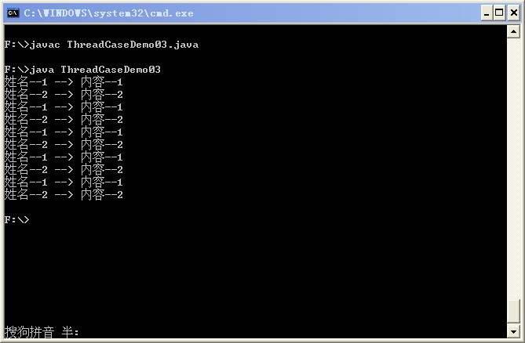

# 生产者—消费者模型

生产者消费者问题是线程模型中的经典问题：生产者和消费者在同一时间段内共用同一存储空间，生产者向空间里生产数据，而消费者取走数据。

这里实现如下情况的生产--消费模型：

生产者不断交替地生产两组数据“姓名--1 --> 内容--1”，“姓名--2--> 内容--2”，消费者不断交替地取得这两组数据，这里的“姓名--1”和“姓名--2”模拟为数据的名称，“内容--1 ”和“内容--2 ”模拟为数据的内容。

由于本程序中牵扯到线程运行的不确定性，因此可能会出现以下问题：

- 假设生产者线程刚向数据存储空间添加了数据的名称，还没有加入该信息的内容，程序就切换到了消费者线程，消费者线程将把信息的名称和上一个信息的内容联系在一起；
- 生产者生产了若干次数据，消费者才开始取数据，或者是，消费者取完一次数据后，还没等生产者放入新的数据，又重复取出了已取过的数据。

问题 1 很明显要靠同步来解决，问题 2 则需要线程间通信，生产者线程放入数据后，通知消费者线程取出数据，消费者线程取出数据后，通知生产者线程生产数据，这里用 wait/notify 机制来实现。

详细的实现代码如下：

```
class Info{ // 定义信息类  
    private String name = "name";//定义name属性，为了与下面set的name属性区别开  
    private String content = "content" ;// 定义content属性，为了与下面set的content属性区别开  
    private boolean flag = true ;   // 设置标志位,初始时先生产  
    public synchronized void set(String name,String content){  
        while(!flag){  
            try{  
                super.wait() ;  
            }catch(InterruptedException e){  
                e.printStackTrace() ;  
            }  
        }  
        this.setName(name) ;    // 设置名称  
        try{  
            Thread.sleep(300) ;  
        }catch(InterruptedException e){  
            e.printStackTrace() ;  
        }  
        this.setContent(content) ;  // 设置内容  
        flag  = false ; // 改变标志位，表示可以取走  
        super.notify();  
    }  
    public synchronized void get(){  
        while(flag){  
            try{  
                super.wait() ;  
            }catch(InterruptedException e){  
                e.printStackTrace() ;  
            }  
        }  
        try{  
            Thread.sleep(300) ;  
        }catch(InterruptedException e){  
            e.printStackTrace() ;  
        }  
        System.out.println(this.getName() +   
            " --> " + this.getContent()) ;  
        flag  = true ;  // 改变标志位，表示可以生产  
        super.notify();  
    }  
    public void setName(String name){  
        this.name = name ;  
    }  
    public void setContent(String content){  
        this.content = content ;  
    }  
    public String getName(){  
        return this.name ;  
    }  
    public String getContent(){  
        return this.content ;  
    }  
}  
class Producer implements Runnable{ // 通过Runnable实现多线程  
    private Info info = null ;      // 保存Info引用  
    public Producer(Info info){  
        this.info = info ;  
    }  
    public void run(){  
        boolean flag = true ;   // 定义标记位  
        for(int i=0;i<10;i++){  
            if(flag){  
                this.info.set("姓名--1","内容--1") ;    // 设置名称  
                flag = false ;  
            }else{  
                this.info.set("姓名--2","内容--2") ;    // 设置名称  
                flag = true ;  
            }  
        }  
    }  
}  
class Consumer implements Runnable{  
    private Info info = null ;  
    public Consumer(Info info){  
        this.info = info ;  
    }  
    public void run(){  
        for(int i=0;i<10;i++){  
            this.info.get() ;  
        }  
    }  
}  
public class ThreadCaseDemo03{  
    public static void main(String args[]){  
        Info info = new Info(); // 实例化Info对象  
        Producer pro = new Producer(info) ; // 生产者  
        Consumer con = new Consumer(info) ; // 消费者  
        new Thread(pro).start() ;  
        //启动了生产者线程后，再启动消费者线程  
        try{  
            Thread.sleep(500) ;  
        }catch(InterruptedException e){  
            e.printStackTrace() ;  
        }  
  
        new Thread(con).start() ;  
    }  
}  
```

执行结果如下：



另外，在 run 方法中，二者循环的次数要相同，否则，当一方的循环结束时，另一方的循环依然继续，它会阻塞在 wait（）方法处，而等不到对方的 notify 通知。
