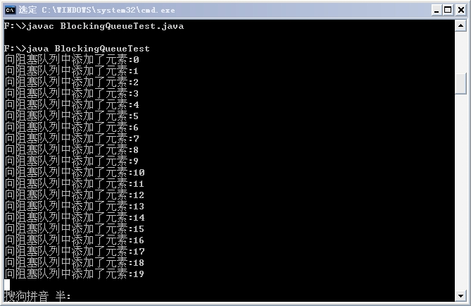
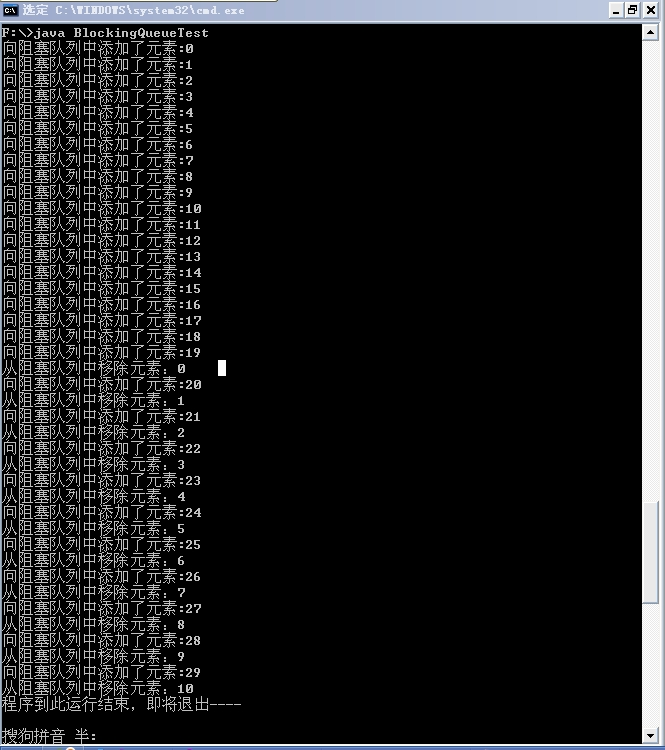
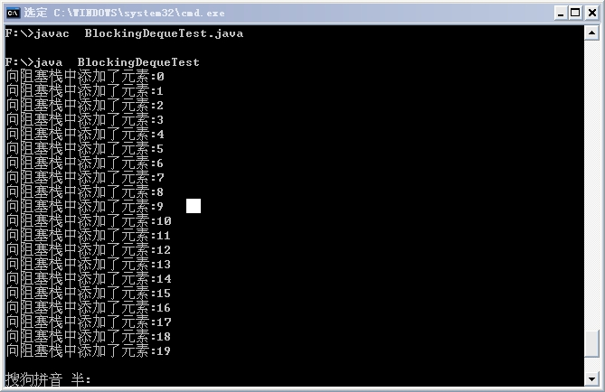
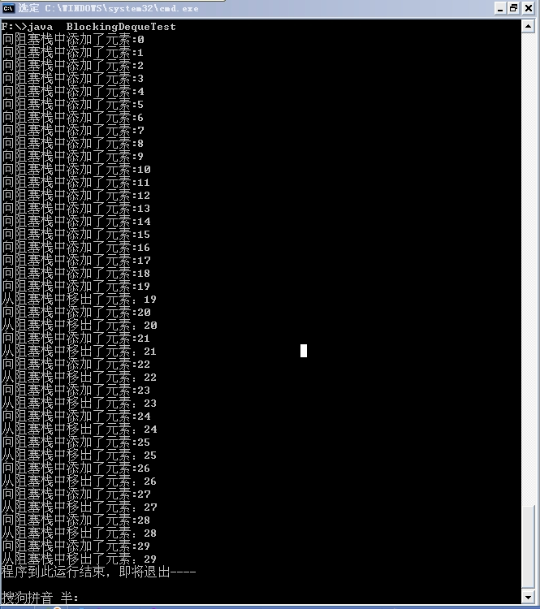

# 并发新特性—阻塞队列与阻塞栈

## 阻塞队列

阻塞队列是 Java 5 并发新特性中的内容，阻塞队列的接口是 java.util.concurrent.BlockingQueue，它有多个实现类：ArrayBlockingQueue、DelayQueue、LinkedBlockingQueue、PriorityBlockingQueue、SynchronousQueue 等，用法大同小异，具体可查看 JDK 文档，这里简单举例看下 ArrayBlockingQueue，它实现了一个有界队列，当队列满时，便会阻塞等待，直到有元素出队，后续的元素才可以被加入队列。

看下面的例子：

```
import java.util.concurrent.BlockingQueue;   
import java.util.concurrent.ArrayBlockingQueue;   
  
public class BlockingQueueTest{   
        public static void main(String[] args) throws InterruptedException {   
                BlockingQueue<String> bqueue = new ArrayBlockingQueue<String>(20);   
                for (int i = 0; i < 30; i++) {   
                        //将指定元素添加到此队列中   
                        bqueue.put("加入元素" + i);   
                        System.out.println("向阻塞队列中添加了元素:" + i);   
                }   
                System.out.println("程序到此运行结束，即将退出----");   
        }   
}  
```

输出结果如下：



从执行结果中可以看出，由于队列中元素的数量限制在了 20 个，因此添加 20 个元素后，其他元素便在队列外阻塞等待，程序并没有终止。

如果队列已满后，我们将队首元素移出，并可以继续向阻塞队列中添加元素，修改代码如下：

```
import java.util.concurrent.BlockingQueue;   
import java.util.concurrent.ArrayBlockingQueue;   
  
public class BlockingQueueTest{   
        public static void main(String[] args) throws InterruptedException {   
                BlockingQueue<String> bqueue = new ArrayBlockingQueue<String>(20);   
                for (int i = 0; i < 30; i++) {   
                        //将指定元素添加到此队列中   
                        bqueue.put("" + i);   
                        System.out.println("向阻塞队列中添加了元素:" + i);   
                        if(i > 18){  
                            //从队列中获取队头元素，并将其移出队列  
                            System.out.println("从阻塞队列中移除元素：" + bqueue.take());  
                        }  
                }   
                System.out.println("程序到此运行结束，即将退出----");   
        }   
}  
```

执行结果如下：



从结果中可以看出，当添加了第 20 个元素后，我们从队首移出一个元素，这样便可以继续向队列中添加元素，之后每添加一个元素，便从将队首元素移除，这样程序便可以执行结束。

## 阻塞栈

阻塞栈与阻塞队列相似，只是它是 Java 6 中加入的新特性，阻塞栈的接口java.util.concurrent.BlockingDeque 也有很多实现类，使用方法也比较相似，具体查看 JDK 文档。

下面同样给出一个简单的例子：

```
import java.util.concurrent.BlockingDeque;   
import java.util.concurrent.LinkedBlockingDeque;   
  
public class BlockingDequeTest {   
    public static void main(String[] args) throws InterruptedException {   
            BlockingDeque<String> bDeque = new LinkedBlockingDeque<String>(20);   
            for (int i = 0; i < 30; i++) {   
                //将指定元素添加到此阻塞栈中  
                bDeque.putFirst("" + i);   
                System.out.println("向阻塞栈中添加了元素:" + i);   
            }   
            System.out.println("程序到此运行结束，即将退出----");   
    }   
}  
```

执行结果如下：



程序依然会阻塞等待，我们改为如下代码：

```
import java.util.concurrent.BlockingDeque;   
import java.util.concurrent.LinkedBlockingDeque;   
  
public class BlockingDequeTest {   
    public static void main(String[] args) throws InterruptedException {   
            BlockingDeque<String> bDeque = new LinkedBlockingDeque<String>(20);   
            for (int i = 0; i < 30; i++) {   
                //将指定元素添加到此阻塞栈中  
                bDeque.putFirst("" + i);   
                System.out.println("向阻塞栈中添加了元素:" + i);   
                if(i > 18){  
                    //从阻塞栈中取出栈顶元素，并将其移出  
                    System.out.println("从阻塞栈中移出了元素：" + bDeque.pollFirst());  
                }  
            }   
            System.out.println("程序到此运行结束，即将退出----");   
    }   
}  
```

执行结果如下：



从结果中可以看出，当添加了第 20 个元素后，我们从将栈顶元素移处，这样便可以继续向栈中添加元素，之后每添加一个元素，便将栈顶元素移出，这样程序便可以执行结束。