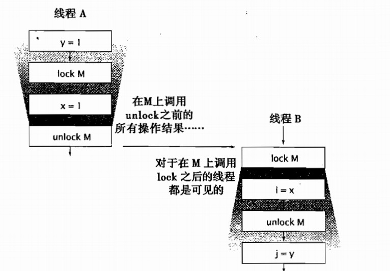

# synchronized 的另个一重要作用：内存可见性

加锁（synchronized 同步）的功能不仅仅局限于互斥行为，同时还存在另外一个重要的方面：内存可见性。我们不仅希望防止某个线程正在使用对象状态而另一个线程在同时修改该状态，而且还希望确保当一个线程修改了对象状态后，其他线程能够看到该变化。而线程的同步恰恰也能够实现这一点。

内置锁可以用于确保某个线程以一种可预测的方式来查看另一个线程的执行结果。为了确保所有的线程都能看到共享变量的最新值，可以在所有执行读操作或写操作的线程上加上同一把锁。下图示例了同步的可见性保证。



当线程 A 执行某个同步代码块时，线程 B 随后进入由同一个锁保护的同步代码块，这种情况下可以保证，当锁被释放前，A 看到的所有变量值（锁释放前，A 看到的变量包括 y 和 x）在 B 获得同一个锁后同样可以由 B 看到。换句话说，当线程 B 执行由锁保护的同步代码块时，可以看到线程 A 之前在同一个锁保护的同步代码块中的所有操作结果。如果在线程 A unlock M 之后，线程 B 才进入 lock M，那么线程 B 都可以看到线程 A unlock M 之前的操作，可以得到 i=1，j=1。如果在线程 B unlock M 之后，线程 A 才进入 lock M，那么线程 B 就不一定能看到线程 A 中的操作，因此 j 的值就不一定是 1。

现在考虑如下代码：

```
public class  MutableInteger  
{  
    private int value;  
  
    public int get(){  
        return value;  
    }  
    public void set(int value){  
        this.value = value;  
    }  
} 
```

以上代码中，get 和 set 方法都在没有同步的情况下访问 value。如果 value 被多个线程共享，假如某个线程调用了 set，那么另一个正在调用 get 的线程可能会看到更新后的 value 值，也可能看不到。

通过对 set 和 get 方法进行同步，可以使 MutableInteger 成为一个线程安全的类，如下：

```
public class  SynchronizedInteger  
{  
    private int value;  
  
    public synchronized int get(){  
        return value;  
    }  
    public synchronized void set(int value){  
        this.value = value;  
    }  
} 
```

对 set 和 get 方法进行了同步，加上了同一把对象锁，这样 get 方法可以看到 set 方法中 value 值的变化，从而每次通过 get 方法取得的 value 的值都是最新的 value 值。