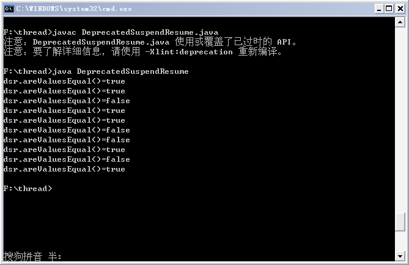
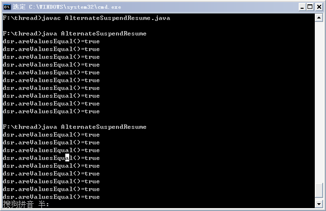
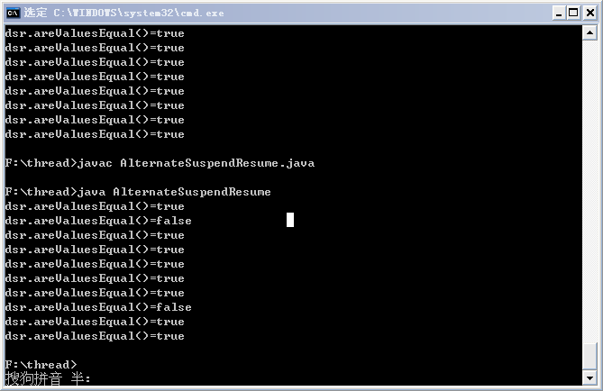

# 线程挂起、恢复与终止

## 挂起和恢复线程

Thread 的 API 中包含两个被淘汰的方法，它们用于临时挂起和重启某个线程，这些方法已经被淘汰，因为它们是不安全的，不稳定的。如果在不合适的时候挂起线程（比如，锁定共享资源时），此时便可能会发生死锁条件——其他线程在等待该线程释放锁，但该线程却被挂起了，便会发生死锁。另外，在长时间计算期间挂起线程也可能导致问题。

下面的代码演示了通过休眠来延缓运行，模拟长时间运行的情况，使线程更可能在不适当的时候被挂起：

```
public class DeprecatedSuspendResume extends Object implements Runnable{  
  
    //volatile关键字，表示该变量可能在被一个线程使用的同时，被另一个线程修改  
    private volatile int firstVal;  
    private volatile int secondVal;  
  
    //判断二者是否相等  
    public boolean areValuesEqual(){  
        return ( firstVal == secondVal);  
    }  
  
    public void run() {  
        try{  
            firstVal = 0;  
            secondVal = 0;  
            workMethod();  
        }catch(InterruptedException x){  
            System.out.println("interrupted while in workMethod()");  
        }  
    }  
  
    private void workMethod() throws InterruptedException {  
        int val = 1;  
        while (true){  
            stepOne(val);  
            stepTwo(val);  
            val++;  
            Thread.sleep(200);  //再次循环钱休眠200毫秒  
        }  
    }  
      
    //赋值后，休眠300毫秒，从而使线程有机会在stepOne操作和stepTwo操作之间被挂起  
    private void stepOne(int newVal) throws InterruptedException{  
        firstVal = newVal;  
        Thread.sleep(300);  //模拟长时间运行的情况  
    }  
  
    private void stepTwo(int newVal){  
        secondVal = newVal;  
    }  
  
    public static void main(String[] args){  
        DeprecatedSuspendResume dsr = new DeprecatedSuspendResume();  
        Thread t = new Thread(dsr);  
        t.start();  
  
        //休眠1秒，让其他线程有机会获得执行  
        try {  
            Thread.sleep(1000);}   
        catch(InterruptedException x){}  
        for (int i = 0; i < 10; i++){  
            //挂起线程  
            t.suspend();  
            System.out.println("dsr.areValuesEqual()=" + dsr.areValuesEqual());  
            //恢复线程  
            t.resume();  
            try{   
                //线程随机休眠0~2秒  
                Thread.sleep((long)(Math.random()*2000.0));  
            }catch(InterruptedException x){  
                //略  
            }  
        }  
        System.exit(0); //中断应用程序  
    }  
} 
```

运行结果如下：



从 areValuesEqual（）返回的值有时为 true，有时为 false。以上代码中，在设置 firstVal 之后，但在设置 secondVal 之前，挂起新线程会产生麻烦，此时输出的结果会为 false（情况 1），这段时间不适宜挂起线程，但因为线程不能控制何时调用它的 suspend 方法，所以这种情况是不可避免的。

当然，即使线程不被挂起（注释掉挂起和恢复线程的两行代码），如果在 main 线程中执行 asr.areValuesEqual（）进行比较时，恰逢 stepOne 操作执行完，而 stepTwo 操作还没执行，那么得到的结果同样可能是 false（情况 2）。

下面我们给出不用上述两个方法来实现线程挂起和恢复的策略——设置标志位。通过该方法实现线程的挂起和恢复有一个很好的地方，就是可以在线程的指定位置实现线程的挂起和恢复，而不用担心其不确定性。

对于上述代码的改进代码如下：

```
public class AlternateSuspendResume extends Object implements Runnable {  
  
    private volatile int firstVal;  
    private volatile int secondVal;  
    //增加标志位，用来实现线程的挂起和恢复  
    private volatile boolean suspended;  
  
    public boolean areValuesEqual() {  
        return ( firstVal == secondVal );  
    }  
  
    public void run() {  
        try {  
            suspended = false;  
            firstVal = 0;  
            secondVal = 0;  
            workMethod();  
        } catch ( InterruptedException x ) {  
            System.out.println("interrupted while in workMethod()");  
        }  
    }  
  
    private void workMethod() throws InterruptedException {  
        int val = 1;  
  
        while ( true ) {  
            //仅当贤臣挂起时，才运行这行代码  
            waitWhileSuspended();   
  
            stepOne(val);  
            stepTwo(val);  
            val++;  
  
            //仅当线程挂起时，才运行这行代码  
            waitWhileSuspended();   
  
            Thread.sleep(200);    
        }  
    }  
  
    private void stepOne(int newVal)   
                    throws InterruptedException {  
  
        firstVal = newVal;  
        Thread.sleep(300);    
    }  
  
    private void stepTwo(int newVal) {  
        secondVal = newVal;  
    }  
  
    public void suspendRequest() {  
        suspended = true;  
    }  
  
    public void resumeRequest() {  
        suspended = false;  
    }  
  
    private void waitWhileSuspended()   
                throws InterruptedException {  
  
        //这是一个“繁忙等待”技术的示例。  
        //它是非等待条件改变的最佳途径，因为它会不断请求处理器周期地执行检查，   
        //更佳的技术是：使用Java的内置“通知-等待”机制  
        while ( suspended ) {  
            Thread.sleep(200);  
        }  
    }  
  
    public static void main(String[] args) {  
        AlternateSuspendResume asr =   
                new AlternateSuspendResume();  
  
        Thread t = new Thread(asr);  
        t.start();  
  
        //休眠1秒，让其他线程有机会获得执行  
        try { Thread.sleep(1000); }   
        catch ( InterruptedException x ) { }  
  
        for ( int i = 0; i < 10; i++ ) {  
            asr.suspendRequest();  
  
            //让线程有机会注意到挂起请求  
            //注意：这里休眠时间一定要大于  
            //stepOne操作对firstVal赋值后的休眠时间，即300ms，  
            //目的是为了防止在执行asr.areValuesEqual（）进行比较时,  
            //恰逢stepOne操作执行完，而stepTwo操作还没执行  
            try { Thread.sleep(350); }   
            catch ( InterruptedException x ) { }  
  
            System.out.println("dsr.areValuesEqual()=" +   
                    asr.areValuesEqual());  
  
            asr.resumeRequest();  
  
            try {   
                //线程随机休眠0~2秒  
                Thread.sleep(  
                        ( long ) (Math.random() * 2000.0) );  
            } catch ( InterruptedException x ) {  
                //略  
            }  
        }  
  
        System.exit(0); //退出应用程序  
    }  
} 
```

运行结果如下：



由结果可以看出，输出的所有结果均为 true。首先，针对情况 1（线程挂起的位置不确定），这里确定了线程挂起的位置，不会出现线程在 stepOne 操作和 stepTwo 操作之间挂起的情况；针对情况 2（main 线程中执行asr.areValuesEqual（）进行比较时，恰逢 stepOne 操作执行完，而 stepTwo 操作还没执行），在发出挂起请求后，还没有执行 asr.areValuesEqual（）操作前，让 main 线程休眠 450ms（>300ms），如果挂起请求发出时，新线程正执行到或即将执行到 stepOne 操作（如果在其前面的话，就会响应挂起请求，从而挂起线程），那么在 stepTwo 操作执行前，main 线程的休眠还没结束，从而 main 线程休眠结束后执行asr.areValuesEqual（）操作进行比较时，stepTwo 操作已经执行完，因此也不会出现输出结果为 false 的情况。

可以将 ars.suspendRequest（）代码后的 sleep 代码去掉，或将休眠时间改为 200（明显小于 300 即可）后，查看执行结果，会发现结果中依然会有出现 false 的情况。如下图所示：



总结：线程的挂起和恢复实现的正确方法是：通过设置标志位，让线程在安全的位置挂起。

## 终止线程

当调用 Thread 的 start（）方法，执行完 run（）方法后，或在 run（）方法中 return，线程便会自然消亡。另外 Thread API 中包含了一个 stop（）方法，可以突然终止线程。但它在 JDK1.2 后便被淘汰了，因为它可能导致数据对象的崩溃。一个问题是，当线程终止时，很少有机会执行清理工作；另一个问题是，当在某个线程上调用 stop（）方法时，线程释放它当前持有的所有锁，持有这些锁必定有某种合适的理由——也许是阻止其他线程访问尚未处于一致性状态的数据，突然释放锁可能使某些对象中的数据处于不一致状态，而且不会出现数据可能崩溃的任何警告。

终止线程的替代方法：同样是使用标志位，通过控制标志位来终止线程。

 