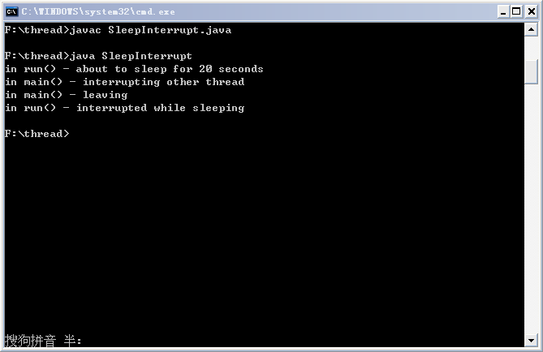
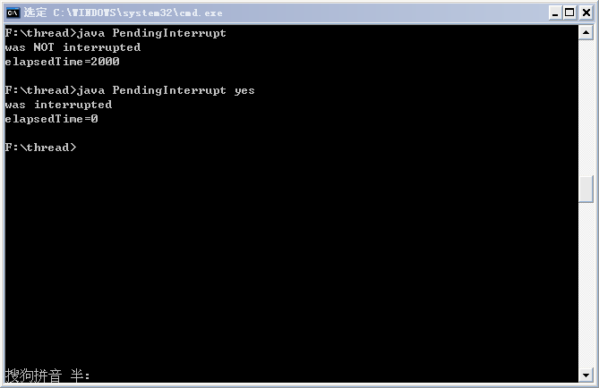
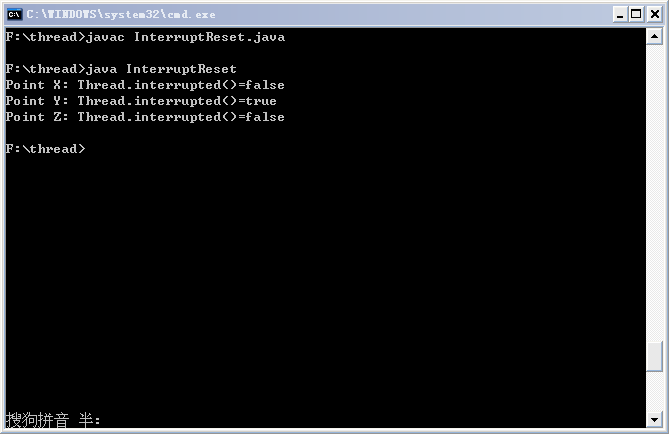

# 线程中断

## 使用 interrupt（）中断线程

当一个线程运行时，另一个线程可以调用对应的 Thread 对象的 interrupt（）方法来中断它，该方法只是在目标线程中设置一个标志，表示它已经被中断，并立即返回。这里需要注意的是，如果只是单纯的调用 interrupt（）方法，线程并没有实际被中断，会继续往下执行。

下面一段代码演示了休眠线程的中断:

```
public class SleepInterrupt extends Object implements Runnable{  
    public void run(){  
        try{  
            System.out.println("in run() - about to sleep for 20 seconds");  
            Thread.sleep(20000);  
            System.out.println("in run() - woke up");  
        }catch(InterruptedException e){  
            System.out.println("in run() - interrupted while sleeping");  
            //处理完中断异常后，返回到run（）方法人口，  
            //如果没有return，线程不会实际被中断，它会继续打印下面的信息  
            return;    
        }  
        System.out.println("in run() - leaving normally");  
    }  
  
  
    public static void main(String[] args) {  
        SleepInterrupt si = new SleepInterrupt();  
        Thread t = new Thread(si);  
        t.start();  
        //主线程休眠2秒，从而确保刚才启动的线程有机会执行一段时间  
        try {  
            Thread.sleep(2000);   
        }catch(InterruptedException e){  
            e.printStackTrace();  
        }  
        System.out.println("in main() - interrupting other thread");  
        //中断线程t  
        t.interrupt();  
        System.out.println("in main() - leaving");  
    }  
} 
```

运行结果如下：



主线程启动新线程后，自身休眠 2 秒钟，允许新线程获得运行时间。新线程打印信息`about to sleep for 20 seconds`后，继而休眠 20 秒钟，大约 2 秒钟后，main 线程通知新线程中断，那么新线程的 20 秒的休眠将被打断，从而抛出 InterruptException 异常，执行跳转到 catch 块，打印出`interrupted while sleeping`信息，并立即从 run（）方法返回，然后消亡，而不会打印出 catch 块后面的`leaving normally`信息。

请注意：由于不确定的线程规划，上图运行结果的后两行可能顺序相反，这取决于主线程和新线程哪个先消亡。但前两行信息的顺序必定如上图所示。

另外，如果将 catch 块中的 return 语句注释掉，则线程在抛出异常后，会继续往下执行，而不会被中断，从而会打印出`leaving normally`信息。

## 待决中断

在上面的例子中，sleep（）方法的实现检查到休眠线程被中断，它会相当友好地终止线程，并抛出 InterruptedException 异常。另外一种情况，如果线程在调用 sleep（）方法前被中断，那么该中断称为待决中断，它会在刚调用 sleep（）方法时，立即抛出 InterruptedException 异常。

下面的代码演示了待决中断:

```
public class PendingInterrupt extends Object {  
    public static void main(String[] args){  
        //如果输入了参数，则在mian线程中中断当前线程（亦即main线程）  
        if( args.length > 0 ){  
            Thread.currentThread().interrupt();  
        }   
        //获取当前时间  
        long startTime = System.currentTimeMillis();  
        try{  
            Thread.sleep(2000);  
            System.out.println("was NOT interrupted");  
        }catch(InterruptedException x){  
            System.out.println("was interrupted");  
        }  
        //计算中间代码执行的时间  
        System.out.println("elapsedTime=" + ( System.currentTimeMillis() - startTime));  
    }  
}
```

如果 PendingInterrupt 不带任何命令行参数，那么线程不会被中断，最终输出的时间差距应该在 2000 附近（具体时间由系统决定，不精确），如果 PendingInterrupt 带有命令行参数，则调用中断当前线程的代码，但 main 线程仍然运行，最终输出的时间差距应该远小于 2000，因为线程尚未休眠，便被中断，因此，一旦调用 sleep（）方法，会立即打印出 catch 块中的信息。

执行结果如下:



这种模式下，main 线程中断它自身。除了将中断标志（它是 Thread 的内部标志）设置为 true 外，没有其他任何影响。线程被中断了，但 main 线程仍然运行，main 线程继续监视实时时钟，并进入 try 块，一旦调用 sleep（）方法，它就会注意到待决中断的存在，并抛出 InterruptException。于是执行跳转到 catch 块，并打印出线程被中断的信息。最后，计算并打印出时间差。

## 使用 isInterrupted（）方法判断中断状态

可以在 Thread 对象上调用 isInterrupted（）方法来检查任何线程的中断状态。这里需要注意：线程一旦被中断，isInterrupted（）方法便会返回 true，而一旦 sleep（）方法抛出异常，它将清空中断标志，此时isInterrupted（）方法将返回 false。

下面的代码演示了 isInterrupted（）方法的使用：

```
public class InterruptCheck extends Object{  
    public static void main(String[] args){  
        Thread t = Thread.currentThread();  
        System.out.println("Point A: t.isInterrupted()=" + t.isInterrupted());  
        //待决中断，中断自身  
        t.interrupt();  
        System.out.println("Point B: t.isInterrupted()=" + t.isInterrupted());  
        System.out.println("Point C: t.isInterrupted()=" + t.isInterrupted());  
  
        try{  
            Thread.sleep(2000);  
            System.out.println("was NOT interrupted");  
        }catch( InterruptedException x){  
            System.out.println("was interrupted");  
        }  
        //抛出异常后，会清除中断标志，这里会返回false  
        System.out.println("Point D: t.isInterrupted()=" + t.isInterrupted());  
    }  
}  
```

运行结果如下：


## 使用 Thread.interrupted（）方法判断中断状态

可以使用 Thread.interrupted（）方法来检查当前线程的中断状态（并隐式重置为 false）。又由于它是静态方法，因此不能在特定的线程上使用，而只能报告调用它的线程的中断状态，如果线程被中断，而且中断状态尚不清楚，那么，这个方法返回 true。与 isInterrupted（）不同，它将自动重置中断状态为 false，第二次调用 Thread.interrupted（）方法，总是返回 false，除非中断了线程。

如下代码演示了 Thread.interrupted（）方法的使用：

```
public class InterruptReset extends Object {  
    public static void main(String[] args) {  
        System.out.println(  
            "Point X: Thread.interrupted()=" + Thread.interrupted());  
        Thread.currentThread().interrupt();  
        System.out.println(  
            "Point Y: Thread.interrupted()=" + Thread.interrupted());  
        System.out.println(  
            "Point Z: Thread.interrupted()=" + Thread.interrupted());  
    }  
}
```

运行结果如下：



从结果中可以看出，当前线程中断自身后，在 Y 点，中断状态为 true，并由 Thread.interrupted（）自动重置为 false，那么下次调用该方法得到的结果便是 false。

## 补充
这里补充下 yield 和 join 方法的使用。

- join 方法用线程对象调用，如果在一个线程 A 中调用另一个线程 B 的 join 方法，线程 A 将会等待线程 B 执行完毕后再执行。
- yield 可以直接用 Thread 类调用，yield 让出 CPU 执行权给同等级的线程，如果没有相同级别的线程在等待 CPU 的执行权，则该线程继续执行。